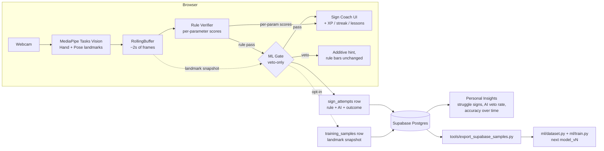

# ASL Learning Game

A gamified **American Sign Language (ASL)** learning app. The player is shown a prompt inside a
themed scenario (a coffee shop, a hospital, …) and must perform the correct ASL sign in front of
their webcam to progress — lessons, story mode, timed challenges, leaderboards, and an XP/streak
system, all gated by a webcam-driven sign recognizer.

**Live app:** React/TypeScript, running entirely client-side (no video ever leaves the browser).
**Origin:** started as a Python desktop prototype (`core/`, `scenarios/`) that proved out the
recognition design before being ported to the web (`web/`), which is now the primary product.

---

## The core engineering decision: rules first, ML as a veto

Most "sign recognition" demos train a classifier on video and call it done. That throws away the
one thing that makes a *learning* tool useful: telling the user **which part of the sign** they
got wrong (your handshape was right, but you didn't move). So this app is built in two layers:

1. **A rule-based verifier** (ported 1:1 from Python to TypeScript) that scores every sign on
   five independent parameters — **handshape, location, movement, palm orientation, non-manual
   markers** — over a rolling ~1.5–2s window of MediaPipe landmarks. This produces the live
   per-parameter checklist ("✅ handshape, ❌ movement") that is the app's actual differentiator.
2. **A trained Bi-GRU classifier**, layered *on top* of the rules as a **veto-only gate**: it can
   only reject a rule-pass when it's confident (≥70%) the user actually signed something else. It
   can never approve a sign the rules rejected, and it never silently overrides the per-parameter
   feedback. An imperfect classifier degrading to "rules alone" is a safe failure mode; an
   imperfect classifier blocking a correct sign is not.

The cardinal rule behind layer 1: **a sign that requires movement is never approved from a single
frame.** An early version of this app passed COFFEE for two motionless fists because it only
inspected one frame — that class of bug is now structurally prevented (the schema *requires* a
movement spec be enforced if declared; see [CLAUDE.md](CLAUDE.md)).

---

## Architecture



The right-hand loop (attempt logging → Insights → export → retrain) is what turns real practice
sessions into the next model version — see [Data collection](#data-collection--analytics) below.

---

## Screenshots

> _TODO: drop screenshots/GIFs here — home screen, a lesson in progress with the per-parameter
> checklist, the AI-debug console output, and the Insights panel._

---

## AI pipeline

```
ASL Citizen (licensed) + WLASL (research license)
        │  tools/extract_dataset.py — batch MediaPipe extraction, signer-disjoint split
        ▼
   Frame-format JSON  (data/landmarks/<SIGN>/<clip>.json)
        │  ml/dataset.py — shoulder-width-normalized features, resampled to a fixed-length
        │                  sequence, cached as one .npz (never re-parsed from JSON during training)
        ▼
   ml/inspect.py — visual gate: every sign sampled back as a stick-figure render BEFORE training
        │
        ▼
   ml/train.py — Bidirectional GRU (TF/Keras), landmark augmentation (rotation/scale/jitter/
        │        time-resample; mirroring intentionally excluded — see comments), evaluated on
        │        HELD-OUT SIGNERS, versioned under ml/runs/model_vN/
        ▼
   ml/sanitize_tfjs.py — strips Keras-only regularizer metadata TF.js can't deserialize
        ▼
   web/public/models/signs/  (model.json + weights, loaded lazily in the browser)
        │
        ▼
   web/src/engine/gate.ts — veto-only combination with the rule verifier
```

Two non-obvious fixes that cost real debugging time and are worth calling out:
- **`reset_after=False`** must be set on every Keras `GRU` layer — the default is the cuDNN
  variant, which TF.js's GRU op rejects outright. All earlier model versions were silently
  unloadable in the browser until this was found.
- **L2 regularizer metadata** in the exported `model.json` is a training-only artifact TF.js
  can't deserialize (`Unknown regularizer: L2`) — `ml/sanitize_tfjs.py` nulls it post-export
  (inference-equivalent; regularization only matters during training).

## Technologies used

| Layer | Stack |
|---|---|
| Recognition (rules) | MediaPipe Tasks Vision (Hand + Pose), numpy/TypeScript geometry, ported 1:1 Python → TS |
| ML training | Python, TensorFlow/Keras (Bidirectional GRU), MediaPipe (batch landmark extraction) |
| ML inference | TensorFlow.js, lazily code-split (`import('@tensorflow/tfjs')`) so the ~1MB chunk only loads if a model is deployed |
| Web app | React 19, TypeScript, Vite, Tailwind CSS v4, Framer Motion, Zustand |
| Backend | Supabase (Postgres + Auth + Row-Level Security) — auth, progress sync, leaderboards, attempt logging, training-data collection |
| Python prototype | OpenCV, MediaPipe, pytest (214 tests) — the recognition ground truth the TS port is checked against |

## Dataset

- **[ASL Citizen](https://www.microsoft.com/en-us/research/project/asl-citizen/)** (licensed) —
  84k videos, 2,731 signs, 52 signers. The primary training source.
- **WLASL** (authorized 2026-06-30) — added for signer diversity per sign after the first model
  (trained on ASL Citizen alone, ~30 clips/gloss) showed clear overfitting on thin classes.
  ⚠️ **WLASL has a non-commercial / research-oriented license and a history of source-video
  takedowns.** It is used here for training/experiments only — verify its license terms before
  any commercial release of a model trained on it. `ASLLVD` is excluded entirely.
- **Our own recordings**, growing via the in-app data-collection pipeline below — this is the
  only fully-owned, commercially clean dataset in the mix, and it's the one that scales with
  actual usage.
- Splits are **signer-disjoint** (whole signers held out for val/test, never split by video) to
  avoid leaking signer mannerisms into the reported accuracy.

## Results — `model_v4`

Bidirectional GRU, 18 signs, trained on the ASL Citizen + WLASL merge:

| Metric | Value |
|---|---|
| Test accuracy | **85.3%** |
| Macro F1 | **85.4%** |
| Weighted F1 | 85.2% |
| Test clips | 273 |

Per-class F1 ranges from 0.67 (MEDICINE — confusable handshape) to 1.00 (WATER, EMERGENCY). The
**EMERGENCY** result is a deliberate caveat, not a brag: it has only **5 total clips** (1 in the
test split), so its 1.00 F1 is statistically meaningless — flagged here rather than left to look
like a strength. This is exactly the kind of class the data-collection loop below exists to fix.

## Data collection + analytics

Every camera-driven attempt — pass, AI-veto, or explicit skip — is logged
(`web/src/hooks/useRecognition.ts`'s `onAttempt` callback, fired from the same gate-evaluation
point that already has the rule result, the AI vote, and the landmark snapshot). Two things come
out of that:

1. **Personal Insights** (Profile → Insights): toughest signs, average attempts-to-pass, lesson
   completion %, AI veto rate, and a 14-day accuracy sparkline. Computed from `security_invoker`
   Postgres views over `sign_attempts`, so Row-Level Security already scopes everything to "your
   own data" — no separate access-control logic needed.
2. **Training data**: when a user hasn't opted out (`profiles.collect_training_data`, on by
   default, toggleable in Insights), the landmark snapshot for that attempt is also saved to
   `training_samples`. `tools/export_supabase_samples.py` pulls those rows with the Supabase
   service-role key (never shipped to the client) and writes them out in the exact Frame-JSON
   format the training pipeline already consumes — closing the loop from "someone played the
   game" to "the next model has more data" with zero manual relabeling.

No video is ever uploaded — only hand/pose coordinate sequences (~50–200KB JSON per attempt).

## Project structure

```
ASL_Game/
├── core/              # Python recognition engine (ground truth for the TS port)
├── signs/             # sign definitions as data (Python)
├── scenarios/         # Python desktop prototype scenarios (coffee_shop, hospital_shop)
├── tools/             # landmark extraction, fixture recorder, Supabase export
├── tests/             # Python confusor regression tests (214 tests)
├── ml/                # dataset builder, inspector gate, Bi-GRU training, TF.js export
├── supabase/
│   └── schema.sql     # full Postgres schema (idempotent, re-runnable)
└── web/                # the live product
    └── src/
        ├── engine/     # TS port of core/ — landmarks, verifier, ML gate, classifier
        ├── hooks/      # useRecognition, useClassifier, useProgressSync, useInsights, …
        ├── pages/      # LessonPage, StoryPage, PracticePage, SpeedChallengePage, …
        └── components/insights/  # Insights panel (struggle signs, accuracy sparkline)
```

## Setup

**Python prototype** (recognition engine, ML training):
```bash
python -m venv .venv && .venv\Scripts\activate     # Windows
pip install -r requirements.txt
python -m scenarios.coffee_shop.main --debug        # live per-parameter score bars
pytest                                               # 214 tests
```

**Web app** (the live product):
```bash
cd web
npm install
cp .env.example .env.local   # add Supabase URL + anon key to enable auth/sync (optional)
npm run dev                  # classifier inactive in dev (see note below)
npm run preview              # production build — classifier active, this is how to test the AI gate locally
```
> The dev server's dependency optimizer mis-bundles `@tensorflow/tfjs`; the rule engine and
> full gameplay work fine under `npm run dev`, but to exercise the ML gate locally, build and
> run `npm run preview` (matches what Vercel actually serves).

**Re-running the Supabase schema** (idempotent — safe against the live DB):
```sql
-- paste supabase/schema.sql into the Supabase SQL editor
```

## Future work

- **Cross-user analytics dashboard** — Insights today is scoped to "your own data" via RLS; an
  admin view aggregating across all users (most-failed sign app-wide, etc.) is a deliberate next
  step once there's enough usage to make it interesting.
- **More EMERGENCY data** — the one class with too few samples to trust its reported metric.
- **Scale to full ASL Citizen** (2,731 signs) — the extraction/training pipeline already
  supports it; today's 18-sign model only covers the in-game vocabulary.
- **Mobile camera performance** — MediaPipe Tasks Vision on lower-end mobile browsers hasn't
  been profiled yet.
- **Social features (Phase B)** — friends/challenges scaffolding exists; multiplayer head-to-head
  matches are next.
